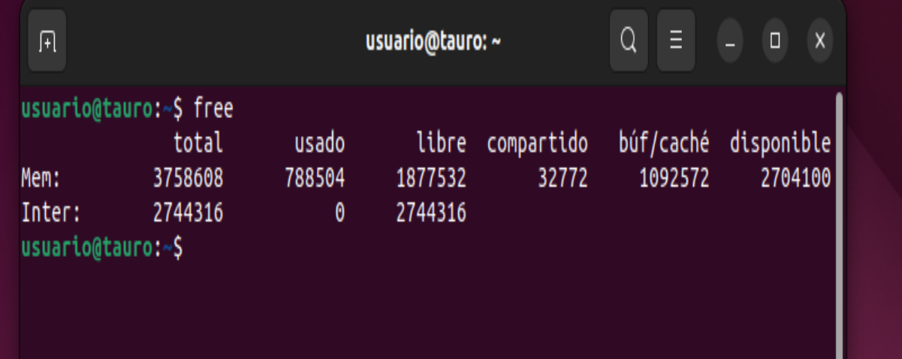
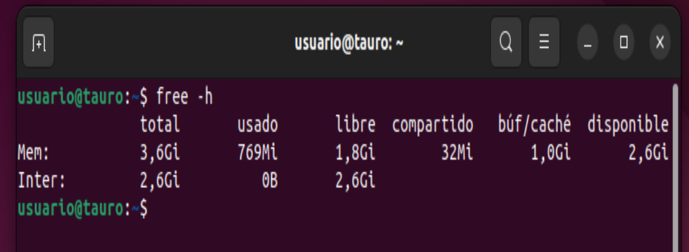
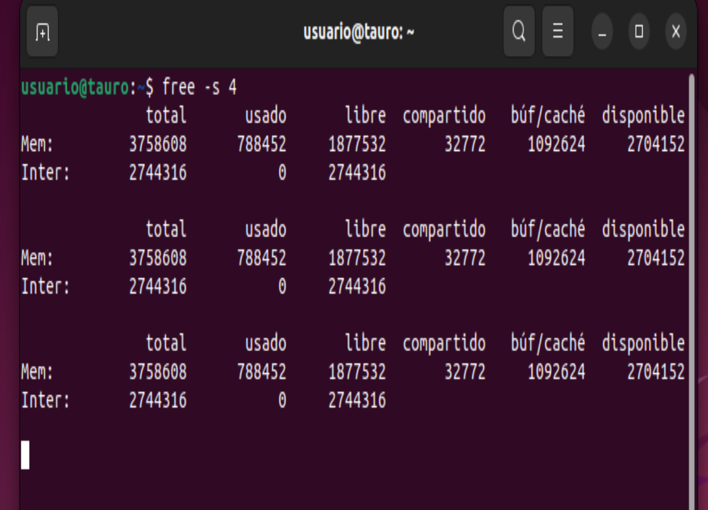
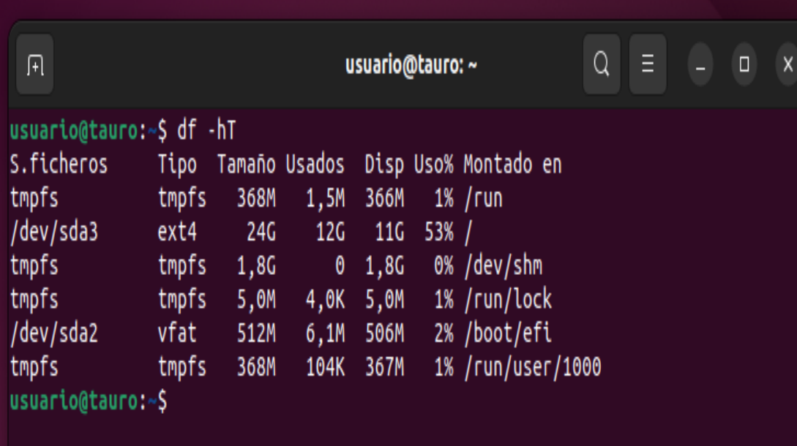
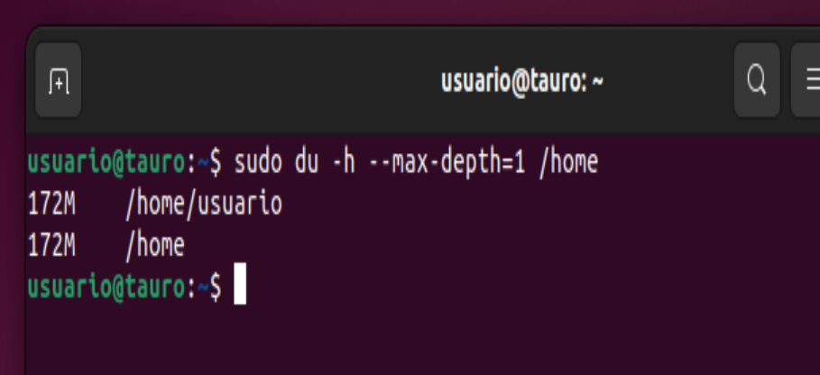

# Para monitorizar el almacenamiento de nuestro sistema existen los siguientes comandos:

## COMANDO FREE 

El comando free se utiliza para mostrar información sobre el uso de la memoria en el sistema, incluyendo la memoria RAM y la memoria swap

Comando `free -h` :

Comando `free -s 4` :

## COMANDO PARA VER EL ESPACIO 

Comando `df -hT` :

Comando `sudo du -h --max-depth=1 /home` :

