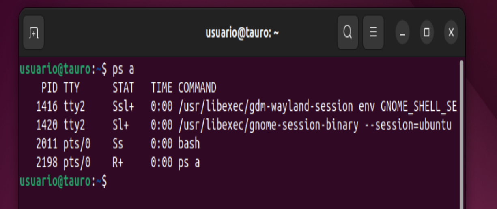

1. Recolección de datos
Es el primer paso del proceso de monitorización, donde se recopilan datos sobre los recursos del sistema (CPU, memoria, almacenamiento, red) y sobre el comportamiento de las aplicaciones o servicios.

2. Análisis de datos
Los datos recolectados son procesados y analizados para identificar tendencias, patrones y anomalías. Este análisis permite detectar comportamientos inusuales que podrían indicar un problema.
Un aumento en el uso de la CPU o la memoria podría indicar que un proceso está funcionando de manera ineficiente o que hay una fuga de memoria.

3. Detección de anomalías
Implica la identificación de eventos o situaciones fuera de lo normal, como un alto uso de recursos, fallos en servicios, desconexiones de red, etc. La monitorización continua permite detectar estas anomalías rápidamente.

4. Generación de alertas
Cuando se detecta una anomalía o un problema, el sistema de monitorización genera alertas para notificar a los administradores del sistema. Estas alertas pueden ser enviadas por correo electrónico, SMS o a través de plataformas de comunicación como Slack.
Un servicio caído puede generar una alerta que notifique al equipo de IT para que se tome acción de manera inmediata.

5. Respuesta ante incidentes
Este proceso se activa después de recibir una alerta. Implica la resolución del problema identificado, que puede incluir reiniciar servicios, liberar recursos, aplicar parches, o cualquier otra acción correctiva.
Herramientas de gestión de incidentes, scripts automáticos para reiniciar servicios, plataformas como PagerDuty o Opsgenie para coordinar la respuesta ante incidentes.

6. Optimización del rendimiento
Después de abordar un incidente o anomalía, se realizan acciones para mejorar el rendimiento de los sistemas, como ajustar la configuración, añadir más recursos o eliminar procesos ineficientes.

7. Generación de informes y visualización
Los datos recolectados y procesados son presentados en informes o gráficos para facilitar su interpretación. Los informes de rendimiento, uso de recursos, tiempo de inactividad, etc., son útiles para la toma de decisiones a largo plazo.

8. Mantenimiento y ajuste continuo
La monitorización es un proceso continuo. A medida que el entorno cambia (nuevos servicios, actualizaciones, cambios en el tráfico), las configuraciones de monitorización deben ajustarse para reflejar estos cambios y seguir siendo eficaces.
Ajustar los umbrales de alerta en función de los patrones cambiantes de tráfico web, o agregar nuevos servidores a la infraestructura monitorizada.

9. Automatización de procesos
La automatización de tareas repetitivas y la respuesta a incidentes puede mejorar la eficiencia de la monitorización. Por ejemplo, reiniciar automáticamente un servicio que ha fallado, o escalar instancias en la nube en función de la carga.

## Los comandos que podemos utilizar para monitorizar los procesos de nuestro ordenador son:

### comando PS


```bash	
ps a
```

```bash	
ps au
```

```bash	
ps aux
```

 ```bash
