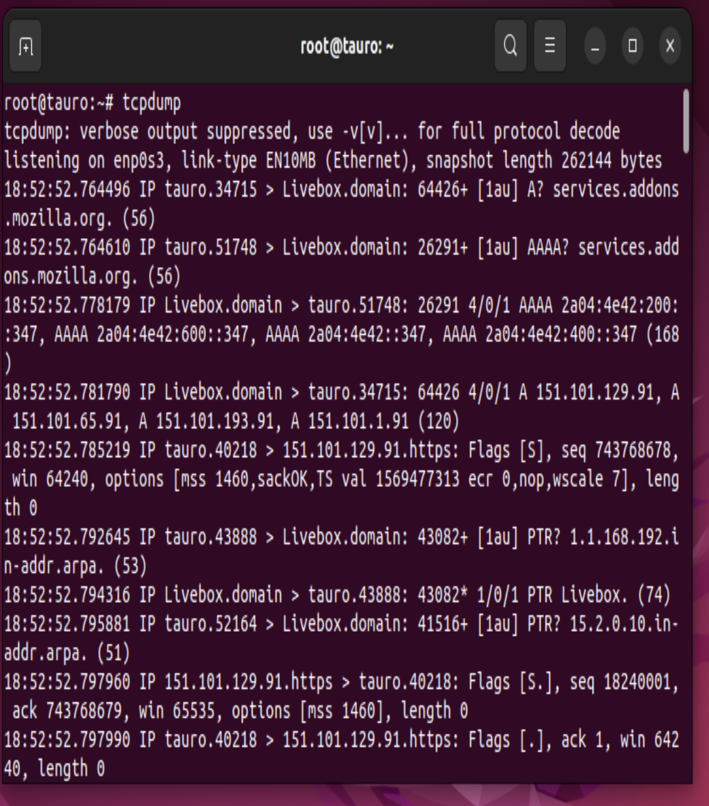
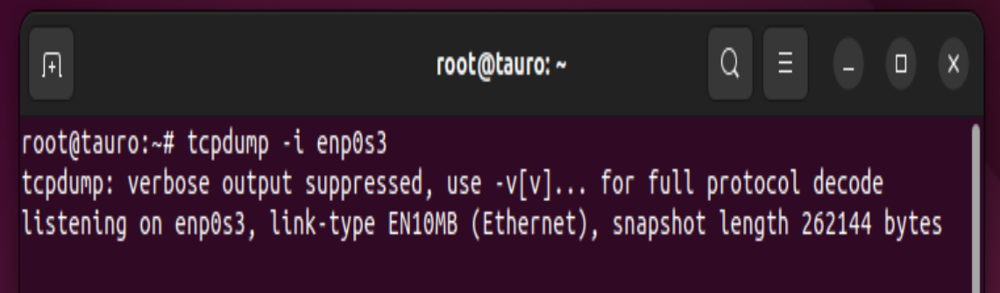
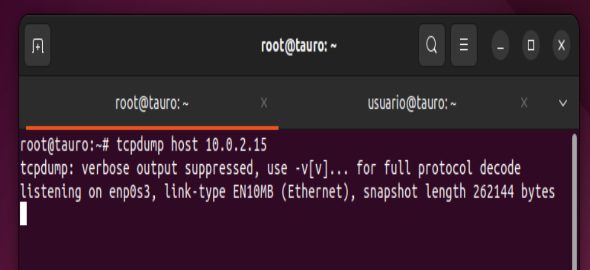
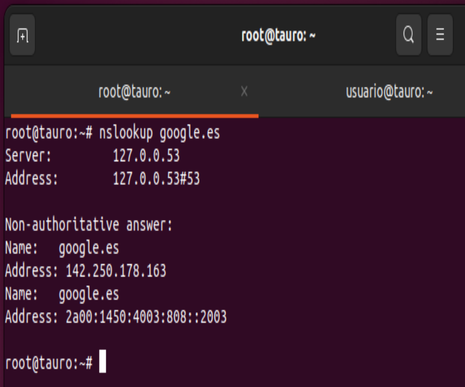
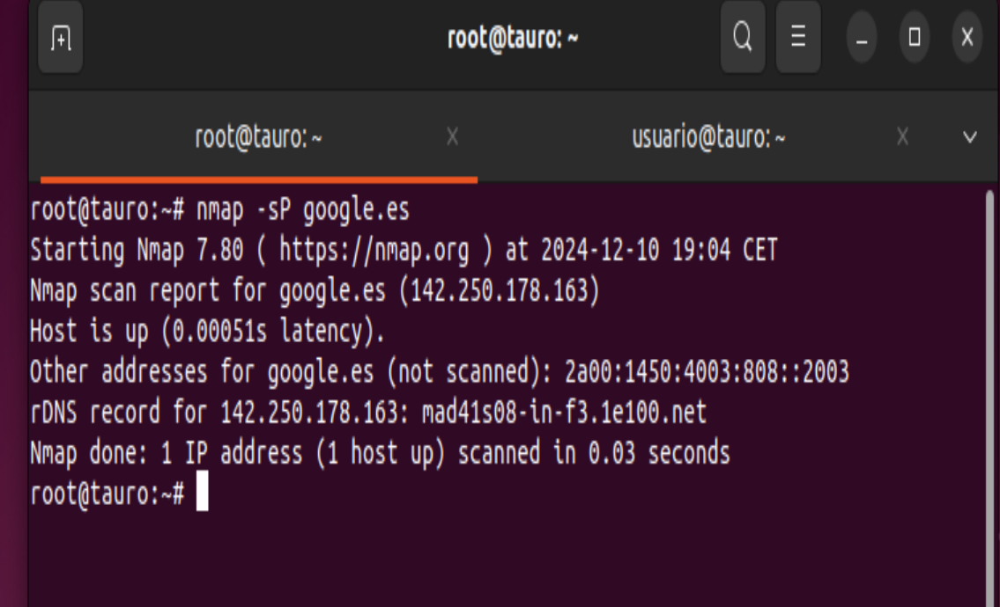

# COMANDOS PARA MONITORIZACION EN RED:

## TCPDUMP

El comando tcpdump es una herramienta de línea de comandos utilizada para capturar y analizar el tráfico de red que pasa a través de una interfaz de red en un sistema. 
Es una de las herramientas más poderosas y ampliamente utilizadas para la monitorización de redes, depuración de problemas y análisis de seguridad.

Comando `tcpdump` :

### CON UNA TARJETA DE RED ESPECIFICA 

Comando `tcpdump -i (tarjeta de red)` :

### A UNA IP ESPECIFICA

Comando `tcpdump host (ip)` :

Comando `tcpdump -r` para hacerlo en modo lectura

## NSLOOKUP

se utiliza para realizar consultas DNS (Domain Name System) y obtener la dirección IP asociada con un nombre de dominio.

## NMAP

 es una herramienta de código abierto utilizada para explorar redes y realizar auditorías de seguridad. 
 Se puede usar para descubrir dispositivos en la red, realizar escaneos de puertos y detectar servicios en ejecución.

 ## TRACEROUTE

  permite rastrear la ruta que siguen los paquetes desde tu máquina hasta un destino. 
  Muestra la secuencia de los routers intermedios por los que pasa el tráfico y el tiempo que tarda en llegar a cada uno.

  
![traceroute(imagenes/img16.PNG)
